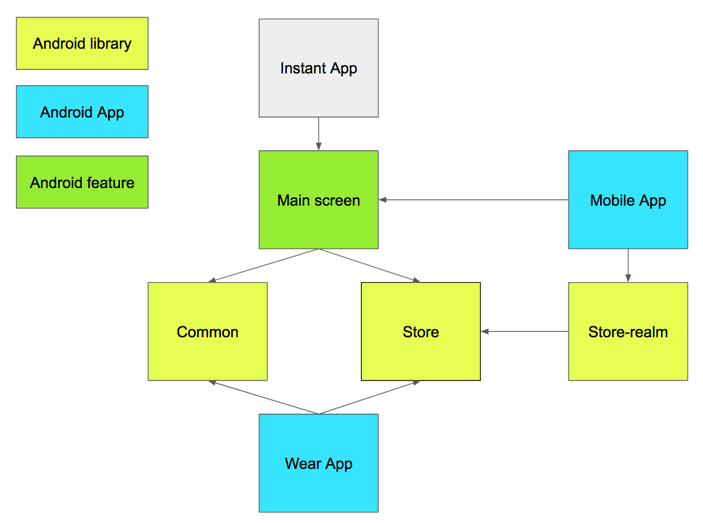

# World day
> Source for the android app `World Day Official` on Google Play

Get advice of all the international celebrations with a smart app
Available on Smartphone and tablet.

## Features
- [x] Display daily info
- [x] Search for any celebration
- [x] Notifications
- [x] Widget
- [x] Watch App
- [x] Instant App

## Requirements

- Android 4.0 Ice Cream Sandwich (API 14)

## Modules architecture

## Application Architecture

This application is using MVVM pattern with android components. Most screen will be split into View and ViewModel.
While the model part remain the same and defined in Store module + ext.

## Contributors

We would love you for the contribution to **World Day Official**, check the ``LICENSE`` file for more info.

* [Lucas Nelaupe](http://www.lucas-nelaupe.fr/) - [@lucas34990](https://twitter.com/lucas34990)

## Licence

Distributed under the GPL-3.0 license. See ``LICENSE`` for more information.
